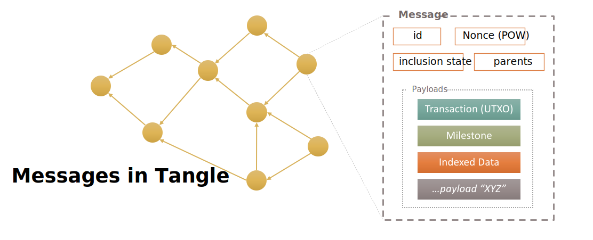

# Messages, Payloads, Transactions

[TODO: rewrite this introduction]

Before we continue, let's introduce some additional terms that describe an unit
that is actually broadcasted in IOTA network. IOTA is based on a concept of
`messages` and `payloads`.

`Message` is a data structure that is actually being broadcasted in IOTA network
and represent a node (vertex) in the Tangle graph. It can refer to up to 8
previous messages and once a message was attached to the Tangle and approved by
a milestone, the Tangle structure ensures the content of the message is
unaltered. Every message is referenced by `message_id` which is based on a hash
algorithm of binary content of the message. `Message` is an atomic unit that is
confirmed by network as a whole.

> IOTA is no longer based on ternary. IOTA 1.5 (Chrysalis) uses binary to encode
and broadcast all underlying data entities

`Message` is broadcasted using a binary format, is arbitrary size (up to 35 kB)
and it can hold a variable sets of information so called `payloads`. Number of
payloads a single message can encapsulate is not given (even a message without
any `payload` at all is completely valid).

`Payload` represents a layer of concern. Some payloads may change a state of the
ledger (ex. `transactions`) and some may provide extra features to some specific
applications and business use cases (ex. `indexed data`).

There are already implemented core payloads, such as `SignedTransaction`,
`MilestonePayload` and `IndexationPayload` but the message and payload
definition is generic enough to incorporate any future payload(s) the community
agrees upon.

Needless to say, IOTA network ensures the outer structure of message itself is
valid and definitely aligned with a network consensus protocol, however the
inner structure is very flexible, future-proof, and offer an unmatched network
extensibility.

The current IOTA network incorporates the following core payloads:
* `SignedTransaction`: payload that describes `UTXO` transactions that are
  cornerstone of value-based transfers in IOTA network. Via this payload,
  `message` can be also cryptographically signed
* `MilestonePayload`: payload that is emitted by Coordinator
* `IndexationPayload`: payload that enables addition of an index to the
  encapsulating message, as well as some arbitrary data. The given index can be
  later used to search the message(s)

### Unspent Transaction Output (UTXO)

IOTA uses `unspent transaction output` model, so called `UTXO`. It is based on
an idea to track unspent amount of tokens via data structure called `output`.

Simplified analogy:
* There is 100 tokens recorded in the ledger as `Output A` and this output
  belongs to Alice. So **initial state of ledger**: `Output A` = 100 tokens
* Alice sends 20 tokens to Paul, 30 tokens to Linda and keeps 50 tokens at
  her disposal
* Her 100 tokens are recorded as `Output A` and so she has to divide (spent)
  tokens and create three new outputs: `Output B` with 20 tokens that goes
  to Paul, `Output C` with 30 tokens that goes to Linda and finally `Output D`
  with the rest 50 tokens that she keep for herself
* **Original `Output A`** was completely spent and can't be used any more.
  It has been spent and so **becomes irrelevant** to ledger state
* **New state of ledger**: `Output B` = 20 tokens, `Output C` = 30 tokens and
  `Output D` = 50 tokens
* Total supply remains the same. Just number of outputs differs and some outputs
  were replaced by other outputs in the process

The key takeaway of the outlined process is the fact that each unique `output`
can be spent **only once**. Once the given `output` is spent, can't be used any
more and is irrelevant in regards to the ledger state.

So even if Alice still wants to keep remaining tokens at her fingertips, those
tokens have to be moved to completely new `output` that can be for instance
still tight to the same Alice's iota address as before.

Every `output` stores also information about an IOTA address to which it is
coupled with. So addresses and tokens are indirectly coupled via `outputs`.
So basically sum of outputs and their amounts under the given address is a
balance of the given address, ie. the number of tokens the given address can
spend. And sum of all unspent outputs and theirs amounts is equal to the total
supply.

Before the chapter is wrapped up, one thing was left unexplained: _"how outputs
are being sent and broadcasted to network?"_ `Outputs` are being sent
encapsulated in a `message` as a part of `SignedTransaction` payload.
